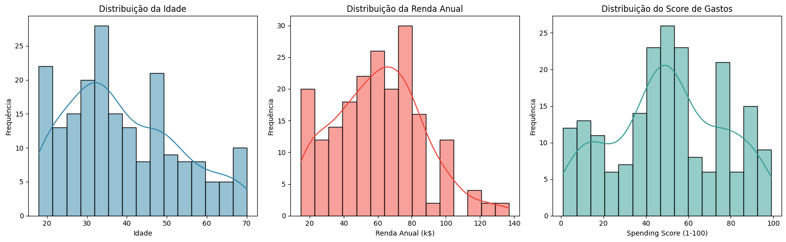
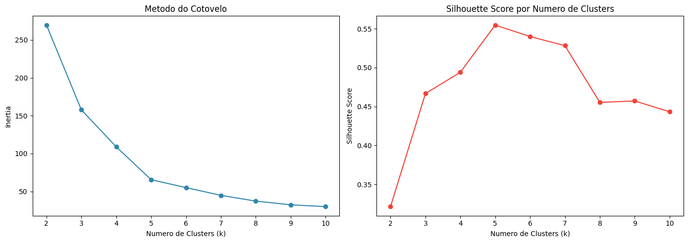
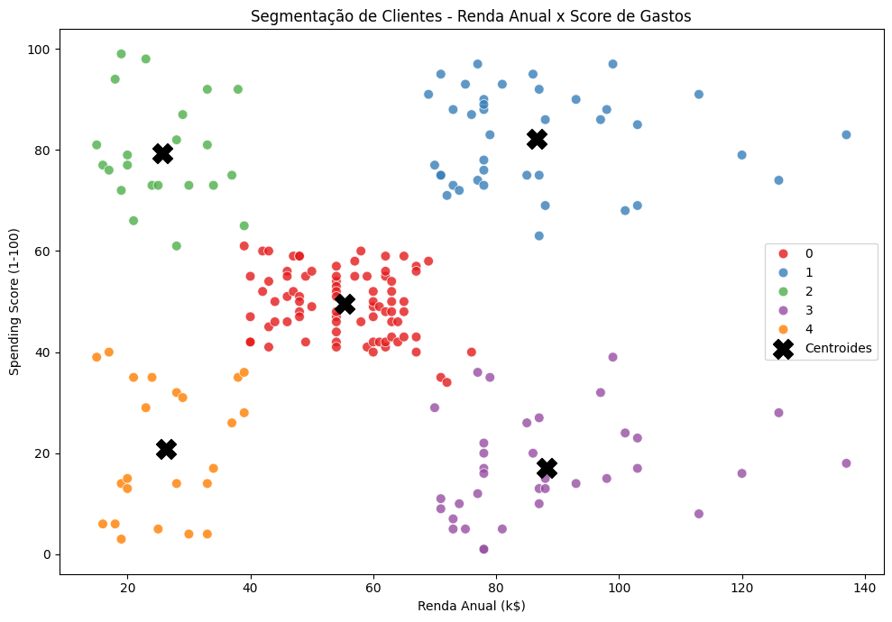

# 👥 Segmentação de Clientes com K-Means

Projeto desenvolvido durante a formação **Profissão: Cientista de Dados da EBAC**, com foco em **aprendizado não supervisionado** e segmentação de clientes utilizando o algoritmo **K-Means**.

---

## 🎯 Objetivo

Identificar diferentes perfis de clientes de um shopping center a partir de características relacionadas à **renda anual** e ao **comportamento de consumo**, criando grupos que possam ser utilizados como base para estratégias de marketing e personalização de ofertas.

---

## 📊 Sobre os dados

O dataset utilizado contém informações de **200 clientes**, com as seguintes variáveis:

| Variável | Descrição |
|---|---|
| `CustomerID` | Identificador único do cliente |
| `Gender` | Gênero do cliente |
| `Age` | Idade do cliente |
| `Annual Income (k$)` | Renda anual em milhares de dólares |
| `Spending Score (1-100)` | Pontuação de gastos atribuída pelo shopping |

---

## 🛠️ Tecnologias e bibliotecas

- Python
- Pandas
- NumPy
- Matplotlib
- Seaborn
- Scikit-learn
- Jupyter Notebook

---

## 🔎 Etapas do projeto

### 1. 📥 Exploração dos dados

Foi realizada uma análise inicial da estrutura da base, incluindo:

- Visualização dos primeiros registros;
- Verificação dos tipos de dados;
- Identificação de valores ausentes;
- Estatísticas descritivas;
- Análise da distribuição das variáveis;
- Distribuição dos clientes por gênero.

A base não apresentou valores ausentes, não sendo necessário realizar remoção ou imputação.

Os dados apresentaram ampla variação de idade, renda anual e score de gastos, oferecendo diferentes perfis para a segmentação.



---

### 2. 🚨 Análise de outliers

Foi utilizado o método do **IQR (Intervalo Interquartil)** para identificar possíveis valores extremos.

Foram encontrados **2 outliers na variável `Annual Income (k$)`**, correspondendo a aproximadamente 1% da base.

Os registros foram mantidos, considerando o tamanho reduzido da base e o fato de representarem clientes com renda elevada que podem ser relevantes para a segmentação.

---

### 3. 🧩 Tratamento e seleção das variáveis

A variável `Gender` foi codificada para utilização posterior na análise dos clusters.

Para o agrupamento, foram selecionadas:

- `Annual Income (k$)`
- `Spending Score (1-100)`

A variável `Age` chegou a ser testada como uma terceira dimensão, porém a comparação das métricas indicou que utilizar apenas **renda e score de gastos** produziu clusters mais bem definidos e de interpretação mais simples para fins de marketing.

---

### 4. 📐 Padronização

As variáveis utilizadas no K-Means foram padronizadas com **StandardScaler**.

A padronização foi importante porque renda e score de gastos possuem escalas diferentes. Sem esse procedimento, a variável de renda poderia exercer maior influência no cálculo das distâncias utilizadas pelo algoritmo.

---

### 5. 📏 Definição do número de clusters

Foram avaliados valores de `k` entre **2 e 10**, utilizando:

- Método do Cotovelo → análise da inércia;
- Silhouette Score → avaliação da qualidade da separação dos grupos.

O método do cotovelo indicou uma mudança relevante por volta de `k = 5`.

O **Silhouette Score atingiu seu maior valor em k = 5**, aproximadamente **0,555**, levando à escolha de cinco clusters.



---

### 6. 🤖 Aplicação do K-Means

Foi treinado o modelo final com:

```python
KMeans(
    n_clusters=5,
    random_state=42,
    n_init=10
)
```

Os clusters foram adicionados à base original para permitir a análise e interpretação dos grupos formados.

---

## 📈 Avaliação e interpretação

O modelo final apresentou **Silhouette Score de aproximadamente 0,555**, indicando uma segmentação com grupos razoavelmente coesos e distintos dentro da base analisada.

A relação entre renda e score de gastos permitiu identificar cinco perfis principais:

| Perfil | Características |
|---|---|
| 💼 Cliente padrão | Renda e score médios |
| 💎 Alta renda e alto consumo | Renda alta e score alto |
| 🛍️ Baixa renda e alto consumo | Renda baixa e score alto |
| 🎯 Alta renda e baixo consumo | Renda alta e score baixo |
| 💤 Baixa renda e baixo consumo | Renda baixa e score baixo |

### Visualização dos clusters



A análise complementar por idade e gênero foi utilizada para ajudar na interpretação dos perfis, sem utilizar essas variáveis diretamente no agrupamento final.

---

## 💡 Aplicações práticas

Os clusters podem apoiar diferentes estratégias de marketing:

- **Alta renda + alto consumo:** ofertas premium, atendimento diferenciado e benefícios exclusivos.
- **Baixa renda + alto consumo:** campanhas com cashback, promoções e parcelamento.
- **Alta renda + baixo consumo:** ações de reativação e campanhas para entender barreiras ao consumo.
- **Baixa renda + baixo consumo:** campanhas sazonais e ações de menor custo.
- **Cliente padrão:** estratégias gerais de fidelização e incentivo ao aumento do consumo.

---

## 🧠 Principais aprendizados

Este projeto permitiu praticar:

- Análise exploratória de dados;
- Estatística descritiva;
- Identificação de outliers;
- Padronização com StandardScaler;
- Aprendizado não supervisionado;
- K-Means;
- Método do Cotovelo;
- Silhouette Score;
- Análise de centróides;
- Interpretação de clusters;
- Segmentação de clientes;
- Aplicação de dados em estratégias de marketing.

---

## 📂 Estrutura sugerida do repositório

```text
customer-segmentation-kmeans/
│
├── data/
│   └── Mall_Customers.csv
│
├── notebooks/
│   └── M33_Segmentacao_Clientes_KMeans.ipynb
│
├── images/
│   ├── distribuicoes.png
│   ├── genero.png
│   ├── cotovelo-silhouette.png
│   └── clusters-renda-score.png
│
└── README.md
```

---

## 📚 Formação

Projeto desenvolvido durante a formação **Profissão: Cientista de Dados — EBAC**.

## 👤 Autor

**Antônio Gabriel Vieira Araújo**

[GitHub](https://github.com/Gabriel-Araujo-dev) · [LinkedIn](https://www.linkedin.com/in/gabrielaraujo05/)
